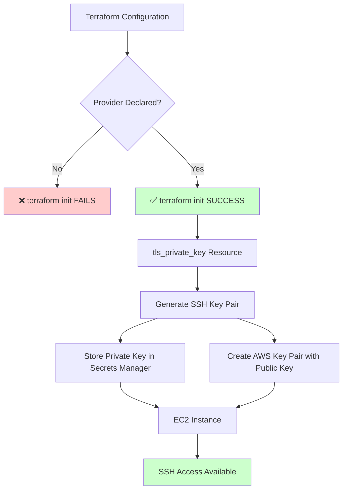

# TLS Provider Flow Diagram

## Key Points:
- **Missing Provider Declaration** = Terraform init fails
- **Proper Provider Declaration** = Full SSH key workflow works
- **TLS Provider** handles cryptographic operations (key generation)
- **AWS Provider** handles AWS resources (EC2, Secrets Manager, Key Pairs)
