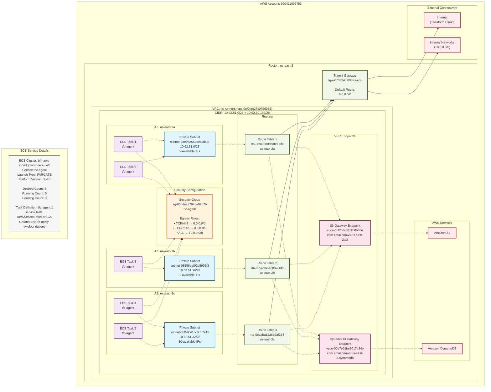

# Network Architecture Diagram

## TFC Runners VPC Network Architecture

## Key Architecture Characteristics

### **Multi-AZ High Availability**
- **3 Availability Zones**: us-east-2a, us-east-2b, us-east-2c
- **Task Distribution**: 2 tasks in 2a, 1 task in 2b, 2 tasks in 2c
- **Auto-rebalancing**: ECS availability zone rebalancing enabled

### **Private Network Design**
- **No Public Subnets**: All subnets are private with `assignPublicIp: DISABLED`
- **No NAT Gateways**: Internet egress via Transit Gateway
- **Small Subnets**: /28 subnets (11 usable IPs each) - minimal footprint

### **Egress Strategy**
- **Primary Route**: 0.0.0.0/0 → Transit Gateway (tgw-070334cf083fca7cc)
- **VPC Endpoints**: Direct access to S3 and DynamoDB via gateway endpoints
- **Security Groups**: Restrictive egress (443, 7146, internal networks only)

### **Service Isolation**
- **Dedicated VPC**: Single-purpose VPC for TFC runners
- **Dedicated Security Group**: Single security group with minimal permissions  
- **No Load Balancers**: Direct task-to-task communication not required
- **No Service Discovery**: Tasks operate independently

### **Missing Components**
- **NAT Gateways**: None present (egress via Transit Gateway)
- **Internet Gateways**: None visible (private-only architecture)
- **SSM VPC Endpoints**: Not configured (no Session Manager access)
- **Public Subnets**: Architecture is entirely private